# 计算机系统I

## Lecture 1	Introduction

程序性能 = 指令数/程序 x 周期/指令 x 时间/周期

##### 冯·诺依曼结构

1. 采用“**存储程序**”的方式进行工作
2. 由**运算器**、**控制器**、**存储器**、**输入设备**和**输出设备5个部件**组成
3. 存储器可以**存放数据和指令**，两者形式上没有区别
4. 计算机内部以**二进制**形式表示指令和数据
5. 每条指令由**操作码**和**地址码**两部分组成


计算机系统是**性能**和**价格**两方面折中的结果，其设计者的主要任务是**确定软硬件的分界**。

计算机系统基本设计原则：

1. 加快经常性事件的执行速度
2. 让尽可能多的部件协调运行
3. 系统尽量在软件上做到兼容


## Lecture 2 ALU

任何计算都可以表达为“加法”：

1. 加减法都可以直观理解为加法
2. 乘法是加法和计数
3. 除法是加法计数和判断

#### 加法功能的具体实现

##### 数字表达——任何数字都可以表达为二进制形式并运算

什么是数制，怎么进行数值转换

##### 门电路——晶体管可以组成表达二进制逻辑的门电路

非门、与门、或门、异或门

*用mos管组成各种门电路


##### 加法器——门电路运用布尔代数可以组成多位加法器

半加器和全加器

##### 算数运算单元ALU——执行算数、逻辑运算的通用单元

约束：整数二进制的宽度限制，被称为字长

符号位：字的最左边，表示正负符号

ALU的通用性：

1. 算术运算：ADD, SUB
2. 逻辑运算：AND, OR, NOR
3. 比较运算：SLT（小于则置1）

##### ALU结构和输入输出

总体运算： A op B = OUT
运算选择 6 种运算的控制： op
进借位： Cin , Cout
重要标记 ：溢出、零结果、借进位等


OF：Overflow Flag溢出标志

CF：Carry Flag进位标志

ZF：Zero Flag零标志


## Lecture 3 Datapath

#### 存储器

存储器是能够储存数据的结构的统称


CLK：存储器时钟

R/W：1为读，0为写

1. 存储器的读可以是组合逻辑
2. 存储器的写必须是时序逻辑

地址Addr：用来访问存储器单元

位宽W：存储器单元的宽度

容量计算公式：
$$
C = 2^N * W (bits)
$$

#### 连接与时序


- 控制线：连接各模块控制接口的一组连接线
- 数据线：连接各模块数据接口的一组连接线
- 地址线：作为地址访问存储器的一组连接线
- 时钟线：用来控制时序逻辑的一组连接线

- 控制线与有关指令控制模块组成**控制通路**
- 数据线、地址线与有关模块组成**数据通路**

##### 寄存器Register（时序逻辑器件）

使用W个D触发器排列组成，解决多输入同步的问题和控制步骤

宽度为一个字长W

暂时存放运算或操作用数据的部件

##### 指令译码器

通过指令有效组织各部件进行运算

设计不同指令适用于不同类型运算

最优化调度指令充分组织部件运算


#### 寄存器堆Register File

寄存器堆：CPU中对个寄存器组成的阵列

**设计目的：**

1. 复用寄存器：使用更少的寄存器满足数据通路需要
2. 限量寄存器：形成一定量寄存器，用于设计指令集


##### *带寄存器堆的数据通路结构


#### CPU执行过程


## Lecture 4 Instructions

### 指令设计

指令是CPU完成任务的最基本单元，是CPU运行最小节奏的表达。

指令包含：**操作码**和**操作数**

##### 指令的设计原则

1. **原子性**：每条指令对应一个**明确且不可分**的操作
2. **独立性**：指令功能完整独立，不依赖于其他指令
3. **通用性**：指令通过配置不同操作数完成通用功能

#### 操作码——CPU支持指令的编码

1.  操作类型：一个指令系统所支持的操作种类
2. 编码方法：表达指令或操作的具体编码方法
3. 指令助记符：每个指令有与之对应的助记符

#### 操作数

##### 立即数

指令中给出的一个用于直接计算的数值，不能作为目的地址

eg. 11001

##### 寄存器编号

访问CPU内寄存器堆的地址

因为规模不大，称为编号

eg. $R1

##### 存储器地址

访问数据存储器的地址

因为规模较大，称为地址

eg. #03

#### 指令表示

操作码助记符：标志指令功能，如 ADD
操作数标记

1. 立即数：imm
2. 源寄存器编号：rs1, rs2
3. 目标寄存器编号：rd


##### RV32I的6种指令格式


### 指令类型

##### 整数计算指令

移位指令 Shifts、算术指令 Arithmetic、逻辑指令 Logical、比较指令 Compare

##### 控制传输指令

条件指令 Branches、跳转指令 Jump & Link

##### 存取指令

存储指令 Stores、加载指令 Loads

##### 其他指令

同步指令 Synch、环境指令 Environ


## Lecture 5 Instruction Control

### 指令译码


控制通路根据操作码对数据通路进行控制

指令经过译码可以获得指令格式及操作数

每条指令的控制逻辑叠加后形成控制通路

##### 指令译码器


#### 指令控制

##### 程序计数器：PC，Program Counter

PC用来存放即将执行指令的地址

顺序执行时，PC+“1” 形成下条指令地址

跳转执行时，PC+offset 形成下条指令地址


字节顺序：

大端：高地址存低字节，低地址存高字节


小段：高地址存高字节，低地址存低字节


#### 指令跳转

跳转指令的特点：对PC进行算术运算，改变下一条执行指令的地址


## Lecture 6 ISA

##### 指令集体系结构ISA

是软件和硬件的分界层，为计算机系统构建了分层体系

##### 指令集≠指令集体系结构

指令集：面向特定目标的一组计算机指令
指令集是设计者表达软件功能需求的主要方式
指令集体系结构：指令集及其抽象实现所关联的一切要素
指令集体系结构是支撑指令集的一个抽象计算机模型

#### 寻址方式

指令中获取操作数的方式

##### 立即寻址

指令直接给出操作数


##### 直接寻址

指令的地址码是操作数的有效地址


##### 间接寻址

指令的地址码是存放操作数有效地址的地址


##### 寄存器寻址

指令的地址码是操作数所在的寄存器编号


##### 寄存器间接寻址

指令的地址码是一个寄存器的编号，其中存放的是操作数的有效地址


##### 基址寻址

CPU中基址寄存器BR的内容+指令中形式地址A，得到操作数的有效地址


##### 变址寻址

指令中心中形式地址A为基址+CPU中变址/通用寄存器IX中的内容，得到操作数的有效地址


##### 相对寻址

程序计数器PC+指令中地址偏移量A，得到操作数有效地址


##### 隐含寻址

不直接给操作数地址，而是在指令中隐含操作数地址


#### X86&ARM指令集（略）

#### RISC-V（略）

#### CISC和RISC

##### CISC复杂指令集计算机

单个指令满足特定需求、指令格式不固定、寻址方式复杂多样

eg. x86

缺点：指令集虽大，但指令使用频度不均衡。CISC指令控制复杂，很难进行指令级并行的性能优化

##### RISC精简指令集计算机

尽量使用少数指令更快解决问题

eg. MIPS


## Lecture 7 Cache

CPU --> 高速计算	存储器-->大量存储	——	体系结构将两种器件分类，获得折中

#### 存储器的层次化结构

1. 寄存器：CPU可见，数量极少、速度快
2. 高速缓存：CPU不可见，数量少、速度快
3. 主存储器：CPU可见，数量大、速度慢

（CPU可见代表为存在地址或编号，能让CPU直接访问）

##### 高速缓存

在CPU内部，用于提高主储存器访问速度的硬件结构，一次地址返回一批数据。用并行增吞吐、用空间换时间


#### 程序的局部性原理

##### 空间局部性

被访问的某个存储单元的邻近单元短时间可能被访问

（指令顺序存储、数据连续存储）

##### 空间局部性利用

访问当前主存单元时，把邻近单元内容调入


##### 时间局部性

被访问的某个存储单元在较短时间内很可能再被访问

（程序循环执行、局部变量频繁访问）

##### 时间局部性利用

当前主存单元被访问后，应保留一段时间


#### Cache

Cache是纯硬件设计，不需要指令控制，对指令透明

块block：Cache与主存交换数据的大小
行line 或 槽slot：Cache中存放一个块的区域
标记：包含一个有效位，表明行内数据是否有效，上电时所有行均无效
冲刷：当某行有效位被置无效时，整行数据淘汰(作废)，加载块后置有效


## Lecture 8 Cache

#### 相关参数计算

**命中率p**：CPU访问单元所在的主存块在Cache中的概率，即Cache命中概率

**缺失率**：不命中次数与访问总次数的比值

**命中时间Tc**：从Cache获得数据的时间

**主存访问时间Tm**：从主存获得数据的时间

**平均访问时间**为：Ta = p ╳ Tc + (1-p) ╳ (Tm+Tc) = Tc + (1-p) ╳ Tm


#### Cache映射方法

##### 直接映射

把主存的每一块映射到固定的一个Cache行，也称模映射

cache行号 = 主存块号 mod cache行数

假设，cache共有16行，主存第100块应该映射到cache第4行中


标记：用来记录主存的高地址部分，与Cache行号一起表示主存地址
Cache行号：直接映射的对应
块内地址：主存的低地址部分，在Cache行内查找具体地址对应内容


##### 全相联映射

把主存的每一行映射到任意一个Cache行
Cache标记用于指出该行取自主存的哪个块
与直接映射相比，缓存最灵活，但查找代价也最大


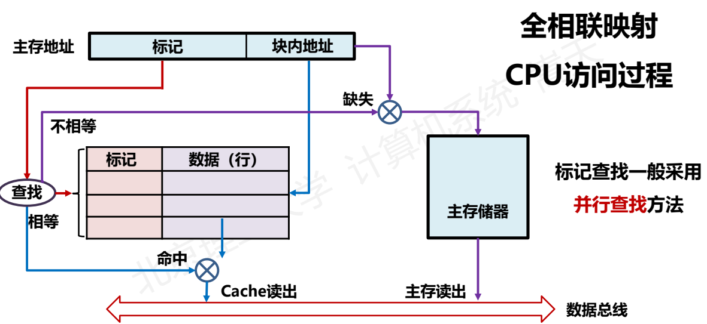

##### 组相联映射

直接映射与全相联映射的优缺点正好相反，组相联将两者结合
将Cache分成大小相等的组，每组包含一定数量行数
组间直接映射：每个主存块地址采用直接映射方式到每个分组
组内全相联映射：在每个Cache分组内，采用全相联方式组织


##### 三种映射方法对比


#### Cache替换算法

##### 先进先出算法：First In First Out, FIFO

在候选行中，总是选择最早装入Cache的Cache行

公平且简单

缺点：FIFO算法很难反映程序的访问局部性，缺失率较大

##### 最近最少使用算法：Least Recently Used, LRU

在候选行中，总是选择近期最少使用的Cache行进行替换

缺点：LRU算法需要表达“近期最少”逻辑，实现复杂

##### 最不经常使用算法：Least Frequently Used, LFU

在候选行中，总是选择引用次数最少的Cache行进行替换

缺点：LFU算法需要表达“次数最少”逻辑，实现复杂

##### 随机替换算法：Random

在候选行中，随机选择一个Cache行进行替换

缺点：随机算法未直接反映程序的局部性原理

随机替换算法在性能上仅次于LRU和LFU


## Lecture 9 Pipeline


门延迟为tg，组合逻辑延迟是tgc 

时钟频率最大是
$$
fclk = 1/max{tgc}
$$

#### 指令流水线设计

##### 流水线

流水线无法提升单个任务的延迟

流水线加速度比约等于流水线段数，效率增加十分可观

流水线的速率受速度最慢的流水段限制


非流水线方式：
26个时钟周期完成6条指令计算

流水线方式：
9个时钟周期完成6条指令计算

加速比：2.89

#### 流水线冒险


将指令拆解为流水线并行执行，会遇到依赖阻塞问题

如果后续指令运行依赖前序指令的运算结果

那么，后续指令引起流水线阻塞或停顿（stall）

##### 三种冒险

##### **结构冒险**：硬件资源冲突造成的冒险

同一部件被不同指令所用，由硬件资源竞争造成


结构冒险消除

①增加多个部件或多个通道寄存器堆：同时读写ALU等：多个运算部件

②借助高速缓存

##### **数据冒险**：数据相关(Data Dependency)引起的冒险

后续指令执行时前序指令的结果尚未产生


数据冒险消除

① 插入空操作	由编译器完成（编译优化）

② 修改数据通路

##### **控制冒险**：指令执行顺序改变引起的冒险

指令跳转等带来的指令顺序改变


控制冒险消除

① 延迟槽 delay slot 重排指令，提前执行分支无关指令，由编译器完成

② 分支预测  预测分支执行，提前预取。由编译器完成，分支预测可能错误，也可能带来数据冒险

#### 指令集并行

指令级并行
• 通过增加硬件冗余，并行执行多条指令
• 主要方法：流水线、多发射
• 充分挖掘一个程序内部指令之间的并行性
• 受程序总体并行性的限制，存在性能提升瓶颈

线程级并行
• 通过增加线程维护上下文，同时执行多个程序
• 主要方法：粗粒度多线程、细粒度多线程、并发多线程
• 充分挖掘多个程序之间的并行性
• 不受单个程序并行性限制，但受硬件并发冗余度的限制

多核并行
• 通过增加多CPU核，提供更多硬件资源，获取并行性
• 由操作系统充分调度多个程序，实现程序并发执行
• 不受单个程序并行性限制，不依赖单个CPU核硬件限制
• 操作系统调度灵活、效果提升显著，但指令效率并不高


## Lecture 10 MMU

#### 进程的地址空间

CPU通过MMU管理存储器

##### 存储管理单元 MMU

MMU包括三个功能：

1. 高速缓存 Cache
2. 虚拟存储管理 Virtual Memory Management 
3. 存储特权 Privileged Memory Management


##### 虚拟存储技术

为程序设置虚拟地址空间，与存储器物理地址空间进行映射


##### Linux进程的地址空间


#### 虚拟存储管理

虚拟存储管理负责虚拟地址和物理地址的相互映射

地址转换：虚拟地址与物理地址
存储调入：主存空间与扩展存储空间
快速执行：优化整体执行效率

##### “请求分页”方法

每次访问指令或数据仅将当前需要的页面从硬盘调入主存
虚拟地址空间划分为大小相等的页面 Page
主存储器被划分为同样大小的页帧 PF：Page Frame 
使用页表Page Table来进行地址转换及调入管理

**未分配页**：没有和任何内容相关联的页

**已分配页**：代码和数据区域所关联的页面

**缓存页**：已调入主存的页面

**未缓存页**：未调入主存而存在外存上的页

#### 页表


页表是进程控制信息
• 页表存储在虚拟地址空间的内核空间
• 页表在存储器的首地址记录在页表基址寄存器中
• 每个进程（程序）需要维护一个页表

##### 分页式虚拟存储器的地址转换


#### 快表

快速查找表 TLB
• 快表 TLB：Translation Lookaside Buffer 
• 提高页表访问速度的一种策略，利用了缓存原理
• 把页表中最活跃的内容复制到Cache中，形成快表
• 对比，主存中的页表被称为慢表


#### 存储特权与保护

##### 存储特权

• 为存储器划分不同的权限级别，形成特权模式
• 限定只有特殊程序（操作系统）才能访问特殊主存空间
• 特权模式是一种重要功能定义，由OS和硬件配合实现
• 管住主存储器就能限制计算机的操作权限

##### 三种特权模式

• S模式：监管模式 Supervisor Mode
• U模式：用户模式 User Mode
• M模式：机器模式 Machine Mode


## Lecture 11 SRAM&DRAM

#### 随机存储器RAM

RAM：Random Access Memory

适用于任意读写顺序的存储器类型

RAM允许任意位置数据以几乎相同的时间读写

RAM主要有两类：SRAM和DRAM

### SRAM

#### MOS管 六管结构

能够存储1位信息


字选择线Word Line 

保持时WL = 0 		读写时WL = 1

位选择线Bit Line 

数据的表示			 两个位线是一组

##### 写入比特1


##### 写入比特0

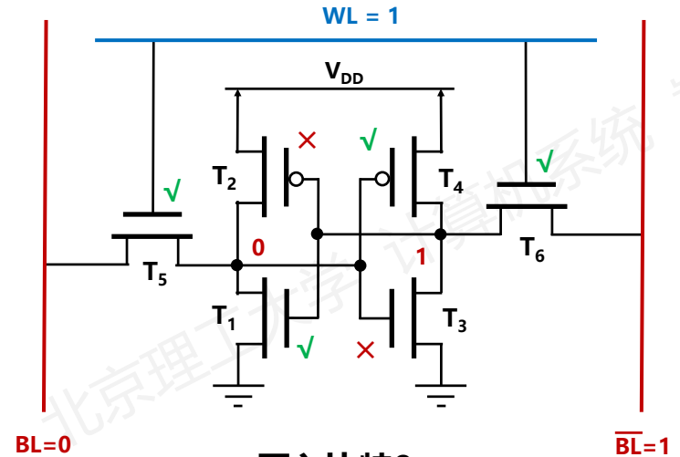

##### 保持比特信息


##### 读取比特1


##### 读取比特0


### DRAM

#### MOS管 单管结构

本质上是靠电容存储信息		由1个MOS管控制


##### 写入比特1


##### 写入比特0


##### 读取


由1个MOS管和电容组成的锁存1位比特的结构
动态：输出和状态与电容有关，需要对电容充电（刷新）
优点：元件少、功耗小、集成度高
缺点：速度慢、需定时刷新

### 存储器结构

存储器芯片由存储体、I/O 读写电路、地址译码和控制电路等部分组成
(1)存储体(存储矩阵)。存储体是存储单元的集合。
(2)地址译码器。用来将地址转换为译码输出线上的高电平，以便驱动相应的读写电路


## Lecture 12 Auxiliary Memory

##### 辅助存储器

系统运行时，与主存储器交换信息的存储器
不与CPU直接进行信息交换，属于外部存储器
采用非易失性型存储器，掉电信息不丢失
包括：磁盘存储器、Flash存储器等

#### 磁盘存储器

由磁记录介质、磁盘驱动器、磁盘控制器组成


盘片：每个盘片两面各有一个磁头
磁头号：表示盘片的盘面编号
磁道：磁头和盘片相对运动的圆轨迹
柱面：多个盘面的相同磁道形成的结构
磁道号：表示柱面编号，即柱面号
扇区：磁道分成的区域，基本读写单位
磁盘地址寄存器：存储读写的盘地址
盘地址：柱面号/磁道号、磁头号、扇区号

##### 读写过程

1. **寻道** 
   根据柱面号移动磁头到磁道
   选择对应磁头号准备读写

2. **旋转等待**

   旋转盘片，扇区计数器清零，维护计数器
   比较计数器与地址中的扇区号，发送符合信号

3. **读写**
   控制器驱动电路批量读写数据


##### 磁盘存储器的性能指标体系

• **记录密度**：磁盘记录信息的密度

1. 道密度：沿磁道分布方向，单位长度的磁道数量
2. 位密度：沿磁道方向，单位长度存放二进制的数量
   相同位密度下，外道比内道存储更多二进制信息
3. 低密度存储方式(扇区数) vs. 高密度存储方式(位密度)

• **存储容量**：磁盘整体的信息容量
	与磁表面大小和记录密度密切相关
	以低密度存储方式为例，未格式化容量的计算方法如下：
$$
磁盘总容量 = 记录面数 * 理论柱面数 * 内圆周长 * 最内道位密度
$$
​	磁盘实际数据容量(也称格式化容量)的计算公式为：
$$
磁盘实际数据容量=2 * 盘片数 * 磁道数 / 面 * 扇区数 / 磁道 * 512B / 扇区
$$
• **数据传输速率**：从存储介质上读写数据的速率

1. 磁盘存储器完成磁头定位和旋转等待后
2. 单位时间内从存储介质上读取或写入的二进制信息量
3. 真实表达磁盘介质的读写能力

• **平均存取时间**：从给出地址到获得数据的平均时间
	磁盘响应过程：

1. 将读写请求放入队列中排队

2. 出队后由磁盘控制器解析请求命令

3. 寻道、旋转等待、读写数据

   总响应时间是：
   $$
   响应时间=排队延迟 + 控制器时间 + 寻道时间 + 旋转等待时间 + 数据传输时间
   $$
   磁盘上的信息以扇区为单位进行读写，其中，存取时间是：
   $$
   存取时间= 寻道时间 + 旋转等待时间 + 数据传输时间
   $$


#### 闪存存储器 Flash

每个存储单元由单个MOS管组成


当栅极G加足够正电压时，浮空栅储存大量负电荷，表示为“0”态
当栅极G不加正电压时，浮空栅少带或不带负电荷，表示为“1”态

闪存的读写
• flash单元初始值是比特1
• flash单元一旦充电，可以保持非常久，约100年
• 由于需要充电，flash单元写速度比读速度慢很多
• flash单元的写入有次数限制，约几万次，之后损坏

#### 冗余磁盘阵列 RAID

**将多个独立操作的磁盘按某种方式组织成磁盘阵列**

容量与速度：利用类似于主存中多体交叉技术，将数据存储在多个盘体上，通过并行工作来提高数据传输速度

可靠性：用冗余磁盘技术进行错误恢复提高系统可靠性

##### RAID级别

根据不同设计，RAID主要分为8个级别：0-7级

RAID 0：没有冗余盘，数据分布在多个物理磁盘上

RAID 1：采用镜像盘一对一冗余

RAID级别不是简单的层次关系，而是不同设计结构


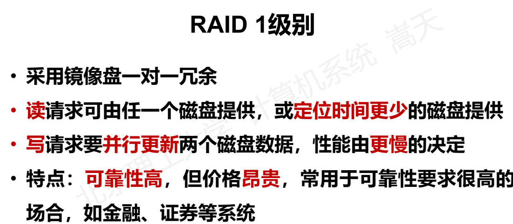


#### 存储数据校验

##### 奇偶检验码

增加一位奇（偶）校验位并一起存储或传送，终部件计算新校验位，比较后判断是否发生错误

**奇校验**：增加校验位后，比特1的个数为奇数
**偶校验**：增加校验位后，比特1的个数为偶数

特点：奇偶校验码只能发现奇数个位出错，不能发现偶数个位出错，也无法判断出错位置
应用： 因为一位出错的概率相对较大，两位以上出错情况较好，所以，奇偶校验码广泛应用于检错

##### 海明校验码

将数据按某种规律分成若干组，对每组进行相应的奇偶检测以提供多位校验信息，从而可对错误位置进行定位，并将其纠正

被校验数据的位数n，校验为k位，则k为组成检测数据的故障字

如果只检测1位错误，则需要满足：
$$
2k ≥ 1 + n + k
$$
即：故障字的结果空间要超过所有的一位错误可能。由此，可以确定k的个数

**海明校验码分组**

n位数据位和k位校验位按某种方式排列为一个(n+k)位的码字，每个出错位位置与故障字数值建立关系，通过故障字确定码字的错误，并将其取反来纠正

规则1：若故障字每位全部是0，则表示没有发生错误
规则2：若故障字有且仅有一位为1，则表示校验位有一位出错，不需纠正
规则3：若故障字中多位为1，则表示有一个数据位出错，其在码字中的出错位置由故障字的数值来确定，纠正时只要将出错位取反即可

**例子   8位数据的检错和纠错**


## Lecture 13 Execution and Lexical Analysis

#### 程序执行过程

在计算机中，源程序以字符的形式存储

而通常英文字符采用ASCII编码方式进行存储


##### 目标文件生成

通过**预处理**、**编译**、**汇编**和**链接**，生成可知执行目标文件


**预处理**对源程序中以字符#开头的命令进行处理
	eg: 例如将 #include 命令后面的 .h 文件内容嵌套到源文件程序文件中

**编译**对预处理后的源程序进行编译，生成汇编源程序

**汇编**将汇编源程序生成一个可重定位的目标文件
	可重定向目标文件内是机器指令

**链接**将多个可重定位目标文件和标准库函数合并成一个可执行目标文件


##### 目标文件执行

**程序的执行**

数据在CPU、主存储器和I/O模块之间流动的过程

执行一个程序的步骤：

1. 将所需程序加载到内存中的某个位置
2. 将PC设置为程序的起始地址


程序的启动和执行依靠操作系统支持

​	- 外壳程序 如 shell 进行命令行的解释

​	- 内核程序 如 read 磁盘 、write屏幕等外设调度

数据流动通过总线 、I/O桥接器实现


机器代码段由多条指令构成
指令是用 0 和 1 表示的一串 0 1 序列
指令通常划分为若干字段 操作码 、地址码 、立即数字等

CPU 通过逻辑电路直接执行用二进制表示的机器指令
通过控制器中的 指令译码器 将指令译码为控制信号


####  指令的执行过程

冯· 诺依曼结构模型机


标志存储器：存放ALU运算得到的标志信息
IR：存放主存读出的指令

程序指令被事先存放在主存中
根据 PC 取指令到 IR，IR 译码并生成控制信号
ALU 读寄存器内容并进行运算 向寄存器写结果


#### 程序预处理

##### 程序的预处理器

在编译之前的阶段 用来进行基本的程序预处理
过程：扫描所有源文件 执行其中的预处理指令
根据预处理指令执行相关的源文件预处理操作

例如：将所有宏定义字符串# DAYS_THIS_ 替换为 30
		    将stdio.h 的内容拷贝至源文件当前位置


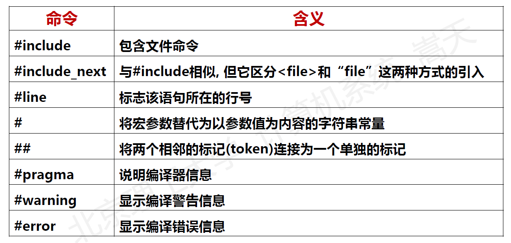

以#开始， #符号不需要在一行的行首
采用如下格式：
	#<指令名> <其他信息>
指令遇到第一个换行符结束
预处理程序：进行查找、替换、删除等 文本型 操作


#### 词法分析

##### 编译

编译 是将源程序映射为语义等价的目标程序的过程
编译器 是完成编译过程的计算机软件
编译总体由 两个 部分组成：
	分析（前端）
	综合（后端）

**分析**

包括：词法分析、语法分析、语义分析、中间代码生成
将源程序分解为多个组成要素，增加语法结构， 理解代码
通过 符号表 配合，将源程序表达为 中间表示 （中间语言）
分析过程，也被称为：编译前端

**综合**

包含：代码优化、目标代码生成
根据 中间表示 和 符号表 来构建 目标程序
综合过程，也被称为：编译后端

**分析阶段**


**词法分析**

词法分析器从输入中读取字符，并将它们组成 词法单元 对象
词素 是构成一个词法单元的字符序列
词法分析器使得语法分析器不需要考虑 词素 的表示方式


1. **剔除空白和注释**
   大部分语言允许词法单元出现任意数量的空白，需要进行修正
2. **预读**
   在分析词法单元时，词法分析器需要先读入一些字符
           如遇到字符后，预读下一个字符是否是=，形成词法单元大于等于
   预先读取的实现方式是不断将字符取出或者放回输入缓冲区
3. **常量**
   在表达式中，允许出现数位的地方可能出现任意长度的整型常量
   词法分析器将多个数位组成整数，并创建一个整型终结符
   例如： 31+28+59 可以被表示为
                <num,31 > <+> <num, 28 > <+> <num, 59 >
4. **关键字和标识符**
   程序设计语言预先定义关键字 ，用来表达某种构造
   程序会定义一些标识符，如 int a =1
   语法分析器将所有标识符当作统一的终结符号 (id)进行表示
   count = count + increment 可以被表示为
          <id,count > <=> <id, count > <+> <id, increment >


## Lecture 14 Compiling Frontend

#### 符号表


符号表是一种保存有关源程序构造信息的数据结构，在编译的各阶段逐步构建完成
在分析阶段逐步构造，在综合阶段用于目标代码生成

符号表的每个条目是一个键值对关系，表示与一个标识符有关的类别，如字符串、类型、地址等


##### 符号表和作用域

作用域：程序中不同的逻辑分区，表达符号作用范围
特有性： 每个作用域设置独立的符号表
原因：程序的不同部分可能多次声明同名标识符
				--  一些常用变量名称 如x、i等
				--  子类覆盖父类中的相应方法

eg: 


符号表之间形成链接关系
	B1代表第一行开始的语句块
	B2代表第二行开始的语句块


编译前端在分析第1行时，符号表指针指向 B1
此时，w 、y对应第1行代码定义的变量


分析第 2-4 行时 符号表指针指向B2
此时，w、y、z对应第2行代码定义的变量


符号表记录了程序所使用的符号及作用域，形成分区字典
符号表由词法分析创建，并由整个编译前端生成维护
经过词法分析，程序变成 token 序列


#### 语法分析

**文法**

描述了程序设计语言构造的层次化语法结构

基本思想：从一组特殊的符号出发，不断应用一些生成式规则，生成一组新的符号组合

eg: 


##### **上下文无关法**

G = (V, Σ, R, S)
V ：一个 非终结符号 的有限集合，句子中的占位符
Σ ：一个 终结符号 的有限集合，构成句子的实质内容
R ：从 V 到 ( V U Σ )* 的关系，构成文法规则
S ：初始变量，用来表示句子开始的非终结符号

上下文无关：在 G 中， V 可以被 任意 字符串 替换
简化了文法中规则的表达，无需考虑规则依赖关系
几乎所有程序设计语言都可以由上下文无关文法表示

##### 语法分析树

用结构展现了从文法的开始符号推导出相应符号串的过程


##### 上下文无关法


##### 语法分析

语法分析是使用文法生成一个终结符号串的过程

分为“自顶向下”和“自底向上”两种
	自顶向下：从根节点开始构造语法树，逐步构造出叶子节点
	自底向上：从叶节点开始逐步构造出根节点


一般来说，为一个非终结符号选择产生式是一个“尝试并犯错 ”的过程，需要在发现产生式不合适时进行回溯
递归下降分析法是一种常用的自顶向下的语法分析方法


#### 中间代码生成

##### **中间语言** 

也叫：中间代码
一种面向语法、易于翻译成目标程序的内部代码表示
可理解性介于源语言和目标语言之间
对源语言提供的丰富表达进行归一，形成统一模式

第一---为了语法统一 便于分析和转换
第二---为了产生高质量的程序，将源语言翻译成中间代码，之后对其进行 优化，再翻译成目标代码

常用的中间代码有：
逆波兰表示
图表示法：抽象语法树 、 DAG 图
四元式
三元式

##### 逆波兰式

将运算符置于其运算对象之后，操作数在前，运算符在后
运算是按照运算符出现的顺序进行 无需括号指示顺序

输入：
$$
A+B*(C-D)+E/(C-D)
$$
逆波兰表示：
$$
ABCD-*+ECD-/+
$$
输入：
$$
(a<0∧b>3) ∨ (e ∧x>y)
$$
逆波兰表示：
$$
a0<b3>∧exy>∧∨
$$


##### 抽象语法树

去掉不必要信息，获得更高效的源程序中间表示
内部结点代表操作符，叶子节点代表操作数


##### DAG(Directed Acyclic Graph) 无循环有向图

与抽象语法树相似，但 DAG 中公共子表达式结点可有多个父结点


##### 三地址码

最基本的形式： **x = y op z**
其中 x 、y、z是名字、常数或编译时产生的临时变量
op 代表运算符号
每个语句的右边只有一个运算符


##### 四元式

一种“三地址语句”的等价表示
一般形式为：**(op, arg1, arg2, result)**
每个四元式只能有一个运算符，一个复杂的表达式由多个四元式构成


##### 三元式

一种“三地址语句”的等价表示
一般形式为 : **(i)(op, arg1, arg2)**
(i) 是三元式的编号，也代表了运算结果
arg 可以是某个三元式的序号(i)


**三元式和四元式的比较**
相同点
按照表达式的实际运算顺序出现，信息表达当量相同
对同一表达式，三元式和四元式个数一般是相同的

不同点
三元式没有 result 字段，不需要临时变量，存储空间占用少
代码优化阶段可能需要频繁移动三地址码语句的位置，四元式具有临时变量，更加灵活


## Lecture 15 Compiling Backend

#### 代码优化


##### 90-10法则

一个程序90%的执行时间花在10%代码上
相对容易实现对一个程序90%的优化，其余10%很难
优化原则：不改变原有代码逻辑且加速程序执行

##### 代码优化

对中间代码及目标代码进行的等价变换，使代码的时空效率提高

优化种类：

**局部**优化：在只有一个入口、一个出口的基础快上进行的优化
**循环**优化：对循环代码进行的优化
**全局**优化：在整个程序范围内进行的优化
**窥孔**优化：针对目标代码的一组简单、局部改进技术

##### 基础块

仅有一个入口和出口的一段代码（入口是第一个语句，出口是最后一个语句）
通过BB(Basic Block)可以构建程序的结构关系
基本块构建采用**最大化**原则，在跳转时被分割

##### 控制流图CFG(Control Flow Graph)

CFG = <V, E, Entry>
	-- V: 基本块构成的集合
	-- E: (V x V)由基本块构成的边，表达程序的控制流
	-- Entry: V的初值，表示程序的入口

CFG每个节点的两个集合
	–– Succ(v) = {x in V| exists e in E, e = v -> x}
	–– Pred(v) = {x in V| exists e in E, e = x -> v}

##### 代码优化方法

**（1）编译期代码执行**

CTFE：Compile-Time Function Execution
在编译阶段对确定代码进行执行并填充结果


效果：更短代码、更少寄存器


**（2）公共子表达式删除**

CSE：Common Subexpression Elimination
发现公共子表达式，并进行替换


定义位：表达式e被赋值且计算的位置p
终结位：表示式e中一个或多个操作数被赋值的位置p
表达式e可以当作公共子表达式删除当且仅当从表达式e到每个后续定义位e之间不存在终结位


效果：更少寄存器、更少计算


**（3）循环不变代码提取**(属于循环优化)

LICR：Loop Invariant Code Removal
将循环中不改变的代码移到pre-header中
一个表达式S: x:=y op z是循环不变代码，当且仅当：y和z没有在循环体内部被修改；S是改变x仅有语句


**（4）循环变量消除**(属于循环优化)

IVE：Induction Variable Elimination
用等价替换方式消除不必要的循环变量
规则：找到两个变化节奏一致的循环变量：x和y


**（5）循环运算强度消减**(属于循环优化)

IVSR：Induction Variable Strength Reduction
用等价替换方式减少循环的计算强度
规则：对循环中计算复杂的操作进行简化，尤其是可被循环变量替代的乘法操作


##### 代码优化完全例子

对左侧代码进行优化

上半部分为初始化逻辑
下半部分为循环逻辑


#### 目标代码生成

##### 目标代码生成的三个任务

1. 指令选择
2. 寄存器分配和指派
3. 指令排序

目标机器指令系统的性质决定了指令选择的难易程度

常见的ISA类型

– RISC精简指令集计算机
– CISC复杂指令集计算机
– 基于堆栈的机器(如JVM)


##### 寄存器分配

寄存器是运行速度最快的存储单元，通常数量少，无法存放所有待计算的信息
由于寄存器数量有限，哪些变量放入寄存器十分关键
未放置在寄存器中的信息将被放置于内存中
指定变量存放于在哪些寄存器的过程
即使单寄存器分配，数学上都是NP完全问题
目标机系统要求寄存器分配遵守特定规则，使问题更复杂


##### 待用信息

在一个基本块内，四元式i对A赋值，在四元式j中引用A，称j为i的待用信息


##### **活跃信息**

活跃信息：在一个基本块内，表示某个变量是否会被引用

与待用信息构成二元组（x，y）

		- 第一元：x是数字，表示将引用的待用行号， ^则表示非待用
		- 第二元：活跃标识，y表示活跃，^表示不活跃


## Lecture 16 Linking

#### 链接概述

##### 链接

将各种代码和数据部分组成一个文件的过程
链接使大型应用分解成多个模块，独立进行修改和编译
程序复杂多变，子程序间通过符号定义和引用
连接过程由链接器执行，合并时在符号引用处填入地址

##### 链接过程

链接实际过程包括：预处理、编译、汇编、链接


**预处理**：cpp main.c -o main.i
运行C预处理器cpp，将C源程序翻译成ASCII中间源文件

**编译**： cc1 main.i -o main.s
运行C编译器cc1，它将main.i翻译成ASCII汇编语言文件main.s

**汇编**：as main.s -o main.o
运行编译器as，它将main.s翻译成一个可重定位目标文件main.o

**链接**：ld main.o sum.o p
运行链接器程序ld，将main.o和sum.o文件组合，创建可执行目标文件p

每个可重定位目标文件中的数据和代码都有自己的分类。
链接将相应的部分合成一个新的节，然后分配地址

链接的本质是合并相同的节

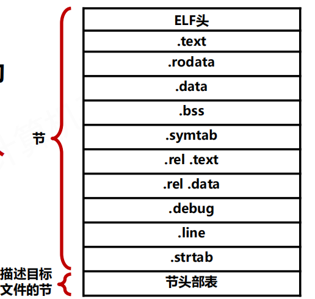

程序头表：
	描述磁盘内容到内存的映射
	映射到虚拟地址空间

虚拟地址：
	包含读写数据段和只读代码段
	由磁盘中的可执行文件相应的节组成


#### 可重定向目标文件

##### 三种形式

**可重定位目标文件(.o)**  --- 所包含的代码和数据可与其他可重定位文件合并为可执行文件
**可执行目标文件(默认为a.out)** --- 所包含代码和数据可直接复制到内存中并被执行
**共享的目标文件(.so)** --- 特殊的可重定位目标文件，在加载或运行时装入内存中并被链接

##### 可重定位目标文件ELF


ELF头：机器类型，节头部表的位置及条目数量和大小，目标文件类型等信息
.text：程序的机器代码
.rodata：只读数据
.data：初始化的全局变量
.bss：未初始化的全局变量，不占用实际空间
.symtab：符号表（存放程序中定义和引用的函数和全局变量信息）
.rel.text：.text节中位置的列表
.rel.data：被模块引用或定义的全局变量的重定位信息
.debug、.line：行号和调试符号表
.strtab：一个字符串表，包含节头部中的节名字等


#### 符号解析与重定位

##### **符号类型**

全局符号：当前模块定义的被其他模块引用的符号
					-- 对应于非静态函数和非静态的全局变量

外部符号：当前模块引用的被其他模块定义的全局符号

本地符号：只被当前模块定义和引用的符号

##### 符号表

由汇编器构造，使用编译器输出的.s文件中的符号

符号表由条目构成


Num：条目序号
Value：距离符号定义节的起始位置的偏移
Size：符号目标的大小
Type：符号是数据/函数
Bind：表示符号是本地的或全局
Ndx：符号所在节的索引，1表示.test，3表示.data
Name：符号名

##### 符号解析

符号解析是将每个符号引用和符号定义联系起来
符号引用和定义的信息存储在符号表中
链接器如何解析多重定义的全局符号是重要问题


**解析多重定义的全局符号**

区分强弱：每个全局符号是强或者弱的
					--- 函数和已初始化的全局变量是强符号，未初始化的是弱符号

定义规则：Linux链接器采用以下规则处理多重定义符号
					--- 不允许有多个同名的强符号
					--- 如果有一个强符号和多个弱符号同名，那么选择强符号
					--- 如果有多个弱符号同名，则从这些弱符号中任意选择一个

##### 重定位

重定位节和符号定义：
	--- 链接器将相同类型的节合并为同一类型新的聚合节
	--- 此时，每个节中的指令和全局变量都有唯一的运行时存储器的地址

重定位节中的符号引用：
	--- 修改代码节和数据节中对每个符号的引用，指向正确的运行地址

##### 重定位条目

重定位条目是重定位符的引用依据
重定位条目在.rel.text和.rel.data中


offset：需要重定位的引用的节偏移
symbol：需要重定位的符号
type：如何修改引用，即重定位的类型

##### 最基本的重定位

**R_386_PC32**：重定位一个使用32位PC地址的相对引用
	--- PC相对地址是距程序计数器PC的当前运行值的偏移量
	--- CPU执行PC相对寻址的指令时，给指令中的32位值加上当前PC得到有效地址

**R_386_32**：重定位一个使用32位绝对地址的引用
	--- 通过绝对寻址，CPU直接用指令中编码的32位值作为有效地址


##### 静态库

编译系统支持将相关模块的一组可重定位目标文件打包为一个文件，用作链接器的输入，这个文件称为静态库

Linux系统中，静态库的文件格式是存档(archive)格式，是一组可重定位目标文件的集合，由一个头部结构描述每个成员目标文件的大小和位置


#### 动态链接与共享库

##### 链接共享库

共享库是解决静态库缺陷的产物

静态库的缺点是需要定期维护更新，并显式将程序与更新的库重新链接，造成空间的较大浪费
共享库是一个目标模块，运行时可加载到任意存储器地址
动态链接：加载后与程序链接，由动态链接器完成

Linux的共享库用.so后缀表示，windows用.dll表示

共享库不需要拷贝到使用它的可执行文件
共享库在存储器中可以被不同的运行进程共享

共享库的链接拷贝部分重定位和符号表信息，用于运行时解析引用
当加载器加载可执行文件时，加载器根据可执行文件的.interp节所记录的动态链接器路径，启动动态链接器完成重定位任务

##### 重定位任务

重定位共享库的数据段和代码段到一个存储器段
重定位所有对共享库定义的符号的引用

完成后，动态链接器将控制传递给应用程序正常执行


#### 程序的加载执行

##### **可执行目标文件**


可执行目标文件和可重定位目标文件的格式相似
不需要**.**rel节，因为重定位已经完成
.init节定义_init函数，进行程序初始化
可执行目标文件易于加载，连续节被映射到连续存储段

##### **程序头部表**

ELF可执行文件保存两个存储段的数据和代码映映射，由程序头部表（programheader table）描述


程序头部表对两个存储段（虚拟与物理）内容进行初始化

第一个段（代码段）与4KB（2^12）边界对齐，具有读权限，从虚拟地址0x08048000开始，总存储大小为0x448字节，用可执行目标文件的第一个0x448字节初始化
第二个段（数据段）与4KB边界对齐，具有读/写权限，从内存地址0x08049448开始，总存储大小为0x104字节，并用可执行目标文件偏移量0x448开始的0xe8字节进行初始化

##### **加载执行目标文件**


## Lecture 17 Program Execution on Memory

#### Core i7地址转换

Core i7 --- 支持48位（256TB）虚拟地址空间和52位（4PB）物理地址空间
				   兼容模式支持32位（4GB）虚拟和物理地址空间

##### Core i7存储系统构成


处理器封装包括：4个核、1个L3高速缓存、1个DDR3内存控制器

##### Core i7存储系统构成


##### Core i7地址转换


采用4级页表层级结构
每个进程拥有私有页表层级结构
CR3指向第1级页表起始位置


页表条目(PET)有3个权限位，控制对页的访问
	- R/W位：确认页的呢日哦那个可读写还是只读
	- U/S位：确定是否能够在用户模式访问此页
	- XD位：用来禁止从某些内容页取指令


##### Linux虚拟内存

虚拟内存区域的内核数据结构

区域：已存在的（已分配的）虚拟内存的连续片，片之间相互关联


#### 程序内存映射

##### 内存映射

将一个虚拟内存区域与一个磁盘上的对象关联起来，以初始化该内存区域的内容

虚拟内存区域 <---映射--->  文件（普通文件、匿名文件）
														 普通文件：一个普通磁盘文件的连续部分
														 匿名文件：由内核创建，包含的全是二进制0

##### 共享区域

映射到共享对象的虚拟内存区域
（下图的映射顺序为：磁盘中的共享对象->进程X的虚拟内存->物理内存）


**一致性问题**：当进程1和进程2写入不同内容时，便出现一致性问题
		私有区域：与共享区域相对，基于“写时复制”实现映射


##### fork()函数

用来建立一个新的子进程

进程调用时

 - 数据结构创建和PID分配
 - 两进程的页面标为只读
 - 两进程的区域结构标记为私有的写时复制

##### execve()函数

在父进程中fork()一个子进程，在子进程中调用exec()函数启动新的程序

- 删除已存在的用户区域
- 映射私有区域
- 映射共享区域
- 设置程序计数器(PC)


#### 动态内存分配

动态内存分配负责维护一个进程的虚拟堆内存区域
	堆：一组不同大小的块的集合
	块：连续的虚拟内存片，已分配/空闲两种状态
	已分配块：应用程序使用
	空闲块：可用来分配

##### 显式分配

要求应用显式释放任何已分配的块
C语言：malloc函数分配块，free函数释放块

##### 隐式分配

要求分配器检测已分配快何时不被程序所使用，然后释放块
垃圾收集器提供隐式分配功能
Lisp/Jva等语言依赖垃圾收集来释放已分配块

##### malloc()函数

负责显式分配块
	返回：指向已分配块的指针，若分配失败则返回NULL
	返回的指针指向大小至少为size字节的内存块
	32/64位模式：块地址为8/16倍数

##### sbrk()函数

负责改变堆的大小
	返回：旧的brk指针，出错则为-1
	sbrk()函数通过将内核的brk指针增加incr来扩展和收缩堆
	返回-1时errno设置位ENOMEM

##### free()函数

负责显式释放已分配块
	返回：无
	ptr必须指向从malloc()、calloc()、或者realloc()获得的已分配块的起始位置

##### 显式堆管理


##### 为什么使用动态内存分配


##### 动态分配的原则

**5个约束条件**

- 处理任意请求序列
- 立即响应请求
- 只使用堆
- 对其块
- 不修改已分配的块

**两个性能目标**

- 最大化吞吐率
- 最大化内存利用率

##### 动态分配的衡量指标

经验中最有效的标准为**峰值利用率**


##### 堆碎片

碎片现象是造成堆利用率低的主要原因

​	内部碎片---已分配块比有效载荷大时发生
​	内部碎片量化——已分配块的大小和有效载荷大小之差的和。只取决于之前请求的模式和动态分配的实现方法

​	外部碎片---空闲内存合计起来满足分配请求但是没有一个单独的空闲块足够大来处理该请求时发生
​	外部碎片量化——取决于之前的请求模式、分配的实现方法和将来请求的模式。通常采用启发式策略来试图维持少量大空闲块


#### 内存垃圾收集

##### 垃圾收集

垃圾收集是Java、ML、Perl等现代语言系统的重要部分
	垃圾收集器：自动释放程序不需要的已分配块的动态内存分配器，这些块被称为垃圾
	垃圾收集：自动回收堆存储的过程
支持垃圾收集的系统应用可显式分配块，无需显式释放

垃圾收集器将内存是为一张有向可达图


##### C语言的垃圾收集


##### Mark&Sweep垃圾收集器

Mark&Sweep建立在malloc基础上

Mark（标记）：该阶段标记出从根节点出发所有可达和已分配的后继
Sweep（清除）：该阶段释放每个违背标记的已分配块


#### 常见内存错误

##### 间接引用坏指针

​	试图间接引用指向没有映射有意义的数据区域的指针
​	试图对虚拟内存只读区域进行写入


##### 读未初始化的内存

​	假设堆内存初始化为零，并直接进行操作


##### 允许栈缓冲区溢出

​	不检查输入串大小就写入栈中目标缓冲区


##### 假设指针和他们指向的对象是相同大小的

​	不同机器上指针大小不同，空间分配时写错类型容易产生隐藏错误


##### 错位错误

​	使用指针时，指针变化边界不明确导致复写等错误


##### 引用指针，而非对象

​	未考虑C操作符的优先级和结核性，容易错误操作指针，而非指针所指对象


##### 误解指针运算

​	指针的算术操作以所指对象的大小为单位计算，该大小单位不一定为字节


##### 引用不存在的变量

​	引用不合法的本地变量导致的野指针存在


##### 引用了空闲堆块中的数据

​	引用已经被释放了的堆块中的数据


##### 引起内存泄漏

​	忘记释放已分配块并在堆中创建垃圾时会导致内存泄漏


## Lecture 18 IA-32 Assembly

#### IA-32指令汇编概述

##### IA-32/x64指令系统概述

x86是Intel开发的一类处理器体系结构的泛称
32位x86架构的名称x86-32改为IA-32（IA为Intel Architecture的缩写）

AMD首先提出了一个兼容IA-32指令集的64位版本
命名为"x86-64"，简称为x64

##### IA-32的体系结构


##### 计算机中数据的存储


##### IA-32支持的数据类型及格式


##### IA-32的寄存器组织


##### 寻址方式


#### IA-32传输指令汇编


（红色为汇编指令长度后缀）

##### 入栈(pushw %ax)


##### 出栈(popw %ax)


##### 程序由指令集序列组成


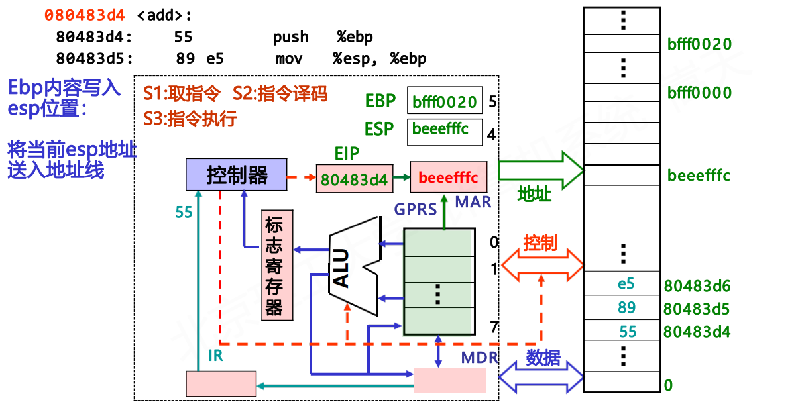


##### 传送指令举例


#### IA-32定点算数指令汇编


##### 程序由指令序列组成


#### IA-32位运算指令汇编

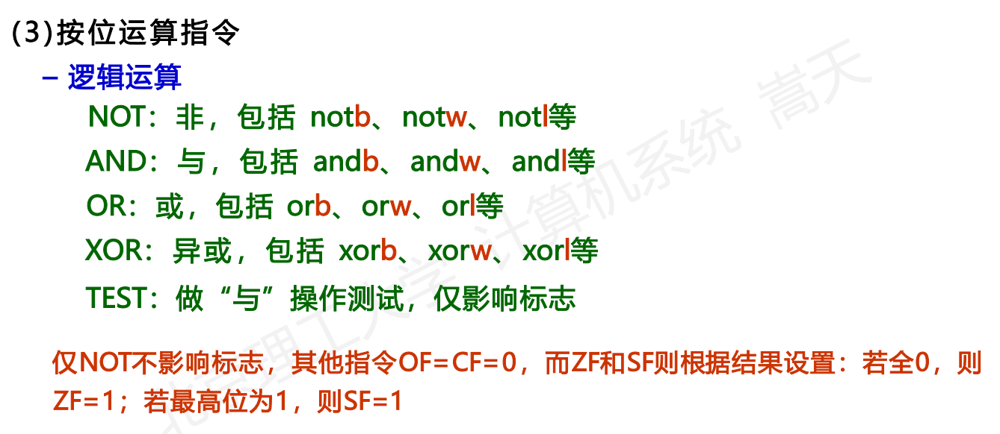


##### 逻辑运算指令举例


##### 移位指令举例


#### IA-32控制转移指令汇编


##### 举例


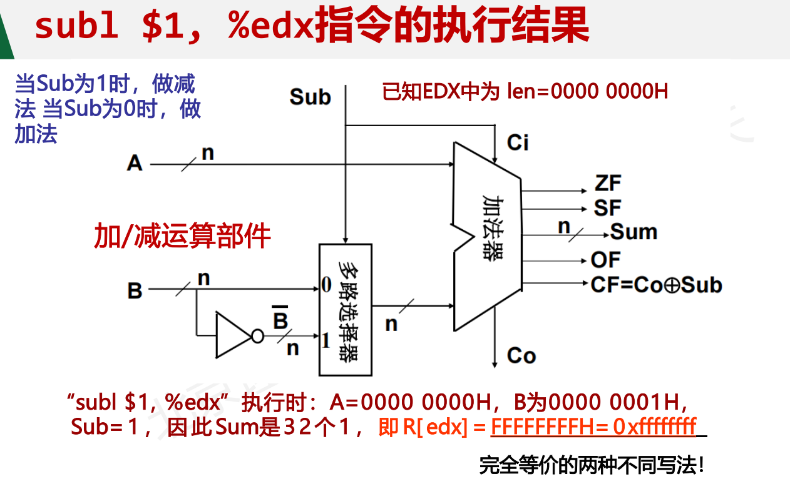


## Lecture 19 Function and Structure Assembly

#### 过程调用的汇编表示

##### 函数的执行


##### 过程（函数）的结构


##### 入口参数的位置


eg:


##### 过程调用的机器级表示


eg:


#### 循环分支的汇编表示

##### 选择结构的机器级表示


eg:


##### switch-case语句举例


##### 循环结构的机器级表示


##### 逆向工程


#### 数组分配的汇编表示

##### 数组的分配和访问


##### 数组元素在内存的存放和访问


eg:指针数组和多维数组


#### 结构体的汇编表示

##### 结构体数据的分配和访问


##### 联合体数据的分配和访问


#### 数据对齐的汇编表示

##### 数据的对齐


eg:


##### 对齐方式的设定


## Lecture 20 x86-64 Assembly and Linking

### IA-32语言回顾

#### 汇编语言作用

汇编指令------算术运算、数据传输、控制转移
汇编语言特性（相比起机器语言）------伪指令代码、保留标签、程序抽象

##### 实例

**main.c**

```c
#include <stdio.h>
void
hello(char \*name, int hour, int min)
{
	printf("Hello, %s, it's %d:%02d.",
	name, hour, min);
}
int
main(void)
{
	hello("BITs", 2, 55);
	return (0);
}
```

运行程序
gcc -S main.c
产生汇编代码文件：main.s

**main.s**

```汇编
        .file "main.c"
        .section .rodata
.LC0:
        .string "Hello, %s, it's %d:%02d."
        .text
.globl hello
        .type hello, @function
hello:
.LFB2:
        pushq %rbp
.LCFI0:
		movq %rsp, %rbp
.LCFI1:
		subq $16, %rsp
.LCFI2:
        movq %rdi, -8(%rbp)
        movl %esi, -12(%rbp)
        movl %edx, -16(%rbp)
        movl -16(%rbp), %ecx
        movl -12(%rbp), %edx
        movq -8(%rbp), %rsi
        movl $.LC0, %edi
        movl $0, %eax
        call printf
        leave
        ret
.LFE2:
        .size hello, .-hello
        .section .rodata
.LC1:
        .string "BITs"
        .text
.globl main
		.type main, @function
main:
.LFB3:
        pushq %rbp
.LCFI3:
        movq %rsp, %rbp
.LCFI4:
        movl $55, %edx
        movl $2, %esi
        movl $.LC1, %edi
        call hello
        movl $0, %eax
<..snip..>
```

**伪汇编指令 Pseudo-Instructions**
类似预处理，它们是汇编器支持的指令，具备特殊功能

.file <string>  创建符号表表项 <string>
.section sec-name 创建一个节，并设为当前节
.string <string> 创建一个字符串
.text 定义当前节为.text
.globl symbol 定义当前symbol为全局符号
.type … 说明当前符号的类型

.section  .text-------区分数据段和代码段

.file  .type  .size------保持源代码和汇编代码的关联关系


#### 汇编与ISA

是相同概念的不同表达
对于汇编器：
	ISA是程序执行的基本模型
	ISA是计算机系统的软件可视结构
对于硬件设计者：
	ISA是正确执行程序的结构定义


#### IA-32汇编·寄存器


#### IA-32汇编·指令

##### **数据传输指令**

```汇编
	movl Source, Dest
```

**操作数类型**
	立即数：常整数，以$开头
		-- $0x400, $-425
		-- 编码为1/2/4字节
	寄存器操作数：8个通用寄存器，以%开头
		-- %eax, %edx
	存储器操作数：存储器中数据，以()表示访存
		-- (%eax)表示用%eax内容作为地址，访问存储器


所有数据传输操作，都要通过寄存器，不能进行存储器->存储器传输

**IA-32汇编·寻址**

Normal              (R)         Mem[Reg[R]]
                          movl        (%ecx), %eax

Displacement  D(R)       Mem[Reg[R]+D]
                          movl       8(%ebp), %edx

**通用寻址模式**

D(Rb, Ri, S) 	Mem[Reg[Rb]+S\*Reg[Ri]+D]

D：常数，偏移量
Rb：基地址寄存器，寄存器编号
Ri：变址寄存器，寄存器编号
S：比例值

**特殊使用情况**

D 				   Mem[D]

(Rb, Ri) 	    Mem[Reg[Rb]+Reg[Ri]]

D(Rb, Ri) 	 Mem[Reg[Rb]+Reg[Ri]+D]

(Rb, Ri, S) 	Mem[Reg[Rb]+S\*Reg[Ri]]

##### 数据传输指令

```汇编
leal Src, Dest
```

lea: Load Effective Address，有效地址加载
与movl形似，但不真实访问存储器，只将Src地址计算后给Dest
例如：leal (%eax), %ecx-----将(%eax)的地址 %eax 赋值给 %ecx

**实例  swap()函数调用**


### x86-64汇编语言

##### 特征

– 兼容：保持对IA-32的兼容
– 扩容：247地址空间，64位指针存储一个地址
– 位置无关代码：使用%rip实现位置无关地址的获取


##### 指令变化

8字节：从长字(long, 4B)到4字(quad, 8B)
新指令：
– movl -> movq
– addl -> addq
– sall -> salq
– …
64位指令产生64位值，32位指令产生32位值，高32位置0，用于兼容

#### x86-64汇编·实例


#### ABI 应用程序二进制接口

• ABI：Application Binary Interface
• 统一接口：理解并链接不同C编译器产生的目标代码
• 统一类型大小：内置数据结构类型，char, int, long等
• 统一过程调用：参数与返回值传递
• 统一寄存器使用

#### x86-64·ABI寄存器约定

临用寄存器：随时用、随时改变
– %rax, %r10, %r11
函数调用传参：传递参数
– %rdi, %rsi, %rdx, %rcx, %r8, %r9
函数可用但需要保存现场：作为临用寄存器的补充
– %rbx, %rbp, %r12-%r15
返回值：
– %rax, %rdx

#### x86-64·过程调用


##### 实例

**main.c**

```c
#include <stdio.h>
void
hello(char \*name, int hour, int min)
{
	printf("Hello, %s, it's %d:%02d.",
	name, hour, min);
}
int
main(void)
{
	hello("BITs", 2, 55);
	return (0);
}
```

运行程序
gcc -S main.c
产生汇编代码文件：main.s

**main.s**

```汇编
        .file "main.c"
        .section 	  .rodata
.LC0:
        .string "Hello, %s, it's %d:%02d."
        .text
.globl hello
		.type hello, @function
hello:
.LFB2:
		pushq 
%rbp
		.LCFI0:
movq 
		%rsp, %rbp
.LCFI1:
		subq $16, %rsp
.LCFI2:
		movq 
        %rdi, -8(%rbp)
        movl 
        %esi, -12(%rbp)
        movl 
        %edx, -16(%rbp)
        movl 
        -16(%rbp), %ecx
        movl 
        -12(%rbp), %edx
        movq 
        -8(%rbp), %rsi
        movl 
        $.LC0, %edi
        movl 
        $0, %eax
        call printf
        leave
        ret
.LFE2:
        .size hello, .-hello
        .section .rodata
.LC1:
        .string "BITs"
        .text
.globl main
		.type main, @function
main:
.LFB3:
		pushq %rbp
.LCFI3:
		movq %rsp, %rbp
.LCFI4:
        movl $55, %edx
        movl $2, %esi
        movl $.LC1, %edi
        call hello
        movl $0, %eax
        leave
        ret
.LFE3:
		.size main, .-main
<..snip..>
```


### x86-64汇编链接

##### 实例


#### 链接·ELF格式

ELF：Executable Linkable Format
一种用来表示可执行程序的可链接格式


**ELF头（ELF header）**：描述文件的基本内容
– 文件格式标识：File format identifier
– 组织架构：Architecture
– 大端/小端设定：Endianness
– 对齐要求：Alignment requirements
– 各节位置：Location of other sections
– 代码起始地址：Code’s starting address
– …

**程序头部表（Program header table）**：其他节调入内存执行的必要信息
– 执行所需库函数等

**节头部表（Section header table）**：链接时的必要信息
– 重分配时需要的信息

**代码节（.text）**：指令所在区域
– 只读

**数据节：**
**– 初始化的只读数据（.rodata）**
**– 初始化的可读写数据（.data）**
**– 未初始化的可读写数据（bss）**BSS：Block Started by Symbol

初始化：初值保存在ELF文件中
未初始化：变量大小保存在ELF文件中
可读写区分：编译决策的用处
– Why？保护只读性
– How？虚拟存储器的页表标记字段

**符号表节（.symtab）**：记录全局变量及函数名称定义的位置
– 在所有可重定位ELF文件中存储

```c
/* main.c */
void swap(void);
int buf[2] = {1, 2};
int main(void)
{
swap();
return (0);
}
```

**重定位信息节（.rel.test & .rel.data）**：描述符号使用的位置和方式
– .text中一组需要链接器修改的位置列表
– 模块定义或引用的其他全局变量重定位信息
– 用于链接器更简单的进行重定位

**调试信息节（.debug）**：

记录源代码与目标代码的关联信息

**其他节（...）：**
– 其他调试信息
– 版本控制信息
– 动态链接信息
– C++ 初始化或回收代码

#### 链接·符号种类

**全局符号**：
– 被模块m定义，但被其他模块引用的符号
– C：static变量/函数 或 全局变量

**外部符号**：
– 模块m引用，但在其他模块定义的符号
– C：extern变量或函数

**本地符号**：
– 被模块m定义及引用的符号
– C：非static变量或函数


#### 链接·步骤

符号解析：
– 确定符号定义位置及相关联数据

重定位：
– 合并模块、重定位代码和数据，基于新的地址解析符号引用


缺失符号，不由编译器报告错误：
– 符号可能再其他文件中定义、编译器仅把未定义符号加入符号表

缺失符号，由链接器报告错误：
– 链接阶段，任何未定义符号，都将产生错误
– 当多个文件定义相同符号时，全局符号需要区分强弱，不一定报错

#### 链接·实例


#### 链接·符号链接


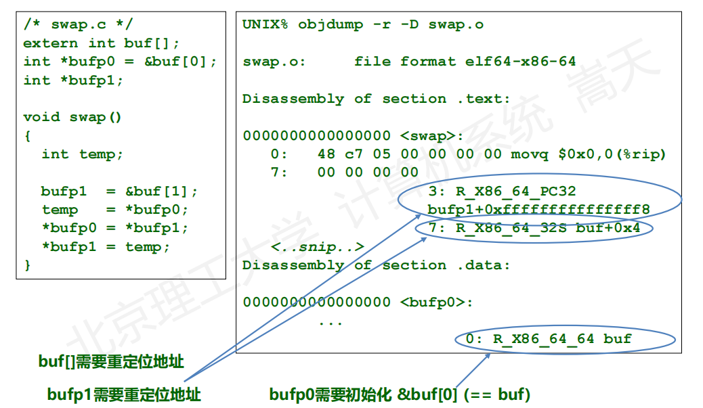


## Lecture 21 I/O Bus and Control

##### I/O设备不直接挂在系统总线上，而是通过I/O接口（I/O控制器）作为桥梁实现和系统总线的连接？

各种I/O设备使用不同的操作方法，由CPU直接控制不同的I/O设备，不切实际
I/O设备的数据传输速度比存储器和处理器的速度慢得多，使用高速的系统总线和慢速的I/O设备直接连接，不切实际
I/O设备经常使用和处理器不同的数据格式和字长度

### 输入输出系统

用户通过I/O设备与计算机交互

I/O设备与计算机通过**设备控制器**连接

##### 总线接口

1. **总线** 组织结构：硬件连接、总线、I/O处理器等
2. **程序控制** 系统控制：中断/轮询、DMA、寄存器等
3. **驱动** 软件驱动：接口功能、数据交换等
4. **接口** 接口信号：串行、并行、同步异步等


设备控制器的两个重要结构：

1. **数据存储器**：保持输入字符
2. **状态寄存器**：聚合交互状态

以键盘为例：


键盘控制器中的状态寄存器：
就绪位、中断允许位 IE、中断标志位 IF、数据溢出标志位


##### 内存映射技术

保留一部分**地址空间**给设备控制器
将设备控制器中寄存器以**内存单元**的形式呈现给 CPU
CPU 使用与内存读写相同的指令与其交互

->不需要额外的 I/O 指令
->通过内存访问指令读取，数据传输高效
->限制可用的内存地址空间
->安全性问题：未经保护的访问会造成漏洞和攻击风险

#### 总线与I/O处理器

##### 总线

系统总线是计算机系统中的一种通信路径，用于连接计算机的主
要组件，提供这些组件之间进行数据传输和控制信号传递的通道


**特性**
连接两个以上部件或设备的信息通路
是各个部件或设备的共享传输介质

**为什么要用总线?**
大大降低部件间互连的复杂性，减少连线数量，成本低
部件间的连接接口统一为与总线的接口，易于增加新设备

**不足**
分时共享，大量同时工作的部件间的信息交换效率降低

**信息传输方式**
串行
并行

**传输速度制约**
总线长度(The length of the bus)
总线连接的设备数(Thenumberofdeviceson the bus)


系统总线是计算机中的关键资源，包含以下部分：
**地址线**： CPU 通过系统总线发送地址信息，访问设备
				位宽决定了处理器可以直接寻址的内存地址数量

**数据线**： 数据的读取、写入和交换
				数据线的数目由总线支持的指令集决定
				数据总线的位宽一般与指令集中定义的数据位数相匹配

**控制线**： 在计算机的各个组件之间传递控制和命令信息
				位数不确定，但需要保证能表达所需控制需求

**中断线**： 传递中断请求
				与所支持中断级别的数目相对应

**中断响应线**： 传输中断响应信号
						与所支持中断级别的数目相对应

**总线仲裁线**： 确保设备按照优先级或时间片获得总线访问权

总线的标准化：
增加了第三方供应商提供可用外围设备的范围
有利于降低产品价格，增加产品配置的灵活性

##### I/O处理器

专门负责处理输入/输出操作的处理器

**使用专门的I/O处理器**

1. 解放主处理器负担：I/O处理器的I/O任务与主处理器分离
2. 并行处理，同时进行多个I/O操作
3. 输出缓存和优化：就具备数据缓存能力，减少对内存的访问
4. 设备管理和控制：对多个I/O设备集中管理和控制

##### I/O控制方式的发展过程

第一阶段: CPU直接控制外设
第二阶段: 增加一个控制器或一个I/O模块，CPU使用编程I/O控制
第三阶段: 采用中断技术，CPU不需要花费时间等待外设执行I/O操作，实现了外设和CPU的并行
第四阶段: I/O模块通过DMA直接传送一块数据到或从存储器传出，不需要CPU全部参与

##### 主板

主板承载了各种硬件组件的连接和集成
主板是单个印刷电路板，包含处理器、内存和I/O 控制器等


北桥：
集线器（ Hub ）芯片，编排 CPU 和内存系统，包括 I/O 控制器之间通信

南桥：
用作 I/O 控制器枢纽的芯片，与标准 I/O 总线连接，并对设备进行仲裁

PCI Express：

支持设备所需的高传输率和响应时间的总线标准

LPC总线：

低带宽设备与CPU连接的标准

高级I/O：

负责慢速设备，如键盘、鼠标等的控制

#### 轮询、中断和DMA

**通过特殊的计算机程序完成数据传输**

例子：键盘控制器的数据传输过程
①当新字符进入数据寄存器： 设置状态寄存器的就绪位
②当 CPU 读取 数据寄存器： 清除就绪位


##### 轮询

随时查询所有外设，有数据输入即获得

**轮询的效率问题**：
处理器通过步骤1、2不断检查设备是否有新数据
获取字符前要无效轮询数百万次 -> 中断方式

轮询模式适用于**大规模数据处理**的接口：如网络安全设备（防火墙、入侵检测系统）

##### 中断

外部设备有数据，则告知CPU获得

**中断的效率问题**：
每次获得数据都需要“中断-响应”过程，单次输入效率低
浪费处理器资源编排数据传输
适合低速输入数据， 不适合网络、内存、硬盘等高速同步设备

中断模式适用于**非大规模数据处理的接口**：如普通计算机系统

#### 非程序控制·DMA(Direct Memory Access)

在CPU没有介入的情况下，设备处理器直接于内存交换


DMA传输与 CPU 类似：

1. DMA 控制器反复访问内存总线
2. 将 N 个连续的字节从内存地址 M 开始装入缓冲区中
3. 缓冲区就绪后，控制器按照指定的设备地址将缓冲区的内容初始化到设备中


## Lecture 22 I/O Bus Protocols

#### PCI总线


##### PCI总线 3 个关键技术

1. 如何扫描和发现连接在PCI 总线上的 I/O 设备？
2. 如何获取I/O 设备寄存器容量？
3. 如何将寄存器的地址与内存地址对应？

PCI桥：将上级总线的数据和命令转发到下一级总线执行

多级PCI桥接：

1. 地址扩展
2. 跨越物理距离
3. 架构扩展灵活
4. 突破共享总线频率限制

实例：将32 位数据写入 I/O 设备的寄存器地址 A 中

1. 仲裁获得总线使用权
2. 在第一个时钟周期内将地址 A 放到地址数据总线中
3. 同时将命令信号放置在命令字总线中

##### PCI总线控制器

1. 操作系统分配：控制器的寄存器空间映射到CPU物理地址
2. 控制器保持：每个I/O控制器**记录**自己的映射地址
3. 控制器响应：每个I/O控制器**仅响应**属于自己地址的请求

每个PCI设备的配置空间：


Vendor ID 设备的供应商
Device ID 设备的型号和版本
Revision ID 固件、外围器件等小版本
Class Code I/O 设备的大类，如控制、网络等
Status 当前 I/O 控制器的状态
Command 与当前工作模式有关的信息

**每个PCI设备的配置空间：**

**BAR**（Base Address Register ），共 6 个。保存PCI 设备可用寄存器空间的基地址，最多6段。BAR只负责通告寄存器容量，不存储任何与 I/O 相关的数据


##### PCI设备的枚举和配置

系统读取PCI控制器的配置信息，如BAR

1. 给每个接入PCI的设备编号，编号的映射关系固定
2. 按照编号访问总线上的寄存器空间
3. 使用选通信号访问特定PCI设备，完成PCI设备的扫描和发现

##### 系统访问特定PCI设备的过程

1. 地址/数据总线上的一部分信号（21根）作为选通信号
2. 通过主板，这些信号分别联通21个设备（接插件）
3. 特定时钟周期内，向命令总线上放置特定命令
4. 下一个时钟周期，选通目标PCI设备

##### 如何通过桥接器读出下游总线某设备的配置信息

逐级定位

1. BID (BUS ID) 定位某一条 PCI 总线
2. DID (Device ID) 定位总线中的某个设备
3. RID (Register ID) 定位设备中的配置空间寄存器


**将PCI控制器的寄存器容量映射到CPU的物理地址空间**

1. 设备管理器查找系统地址分配表，寻找空闲物理地址
2. 将寄存器物理地址更新到系统地址分配表中
3. 设备的驱动程序将物理地址映射到虚拟地址中


#### PCI Express 总线

##### PCI的缺陷

1. 速度和带宽限制
2. 性能瓶颈（共享总线结构，设备需要竞争资源进行通信）
3. 扩展性受限
4. 电源管理和热插拔支持不足

##### PCIE的改进思路

1. 将**共享**总线改为Crossbar**交换**方式
   
2. 将**并行链**路通道改为**高速串行**链路通道
   
   
3. 让**同步**数据收发模式改为**异步**队列模式
   

**关于升级为Crossover交换方式**

在不改变PCI 控制器和 I/O 设备的前提下加入 PCIE 交换完成功能升级


**Step 1：枚举设备**

传统 PCI 设计 -> 并行总线选通
PCIE 设计 -> 交换机原理
给每个 PCIE 交换端口后面挂接的设备映射成固定的 ID
PCIE 上的任何数据包都需要标识目的设备和源设备地址


​	**PCIE 交换机结构**

​	将一串比特从一个端口交换至另一个，与大多数交换设备类似


​	**两个交换机级联的情景**

​	两个交换机各自具有设备ID-端口对应表

​	通过增加一个桥接器连接两个交换机，将设备地址请求转换


#### USB总线

USB设备和计算机的连接：先接入I/O桥片，再利用I/O桥上的访存总线（如PCIE）与CPU沟通

USB主控制器与PCIE管理方式类似，也存在暴露的寄存器以及对应的内存地址

CPU如何把以太网帧传送到网络上？
①以太网帧先在主存中生成
②帧被转入 USB 控制器的寄存器中
③USB 控制器将数据转入 USB 网卡

**USB总线的拓扑**
与 PCI 总线类似，采用共享总线方式
每个 USB 设备拥有一个 7 位的 USB 总线地址
USB Hub 将上游方向的数据广播到下游端口，同时会有信号增强功能

**USB总线的热插拔**

为了降低系统复杂性， USB 不使用中断
在 Hub 内部设置一个状态改变寄存器 Status Change Register
每当有端口状态变化，其对应位改变用以通知控制端


## Lecture 23 I/O Operation via Software

#### I/O软件操作概述

##### **I/O软件**

负责输入和输出数据
高级语言中，专门负责 I/O 操作的 I/O 库函数
I/O 库函数 通过“软中断指令”调用 系统内核 实现 I/O
任何 I/O 操作最终都由 系统内核 控制完成

##### **I/O软件采用层级结构**

用户I/O 软件 ：提出请求
内核I/O 软件 ：管理控制
I/O硬件 ：完成具体操作

##### **操作系统在I/O 中的作用**

①共享性： I/O 资源被多个进程共享，需要 OS 统一调度，保证吞吐
率和安全性（效率 安全）
②复杂性： I/O 设备控制细节复杂，如果交由上层软件控制，会给
开发人员带来麻烦（简化）
③异步性： I/O 系统速度较慢且不同设备差异大，需要 OS 完成中断
过程（兼容）

##### 用户程序、C语言库与内核之间的关系


##### I/O操作的大致过程

①CPU 在**用户态**执行用户进程
②CPU 执行到陷阱指令时，进入**内核态**
③CPU 根据陷阱指令的**系统调用号** ，执行**系统调用服务程序**
④执行对应的**设备驱动程序**
⑤启动外设工作，外设准备好后发送**中断请求**
⑥CPU 响应中断，基于**中断服务程序**与外设交互


#### I/O用户空间操作


用户I/O 软件可以使用标准 I/O 库函数或系统调用封装函数


**标准I/O 函数**： 抽象层次更高，对系统调用进行封装
-> 移植性好，可在不同平台下运行
-> 使用缓冲区，可以在一定程度上提高执行效率（ DMA
-> 同步操作，即程序必须等待 I/O 完成后才能继续执行
-> 缓冲区溢出等安全风险

##### 在类UNIX 系统中，所有的 I/O 操作都是通过读写一个文件实现的

对于用户程序来说：
访问物理设备 = 读写一个真正的磁盘文件

例如：
键盘 = 可读文件，显示器 = 可写文件
“一切皆文件”是UNIX 基本设计哲学

##### 文件的分类

按照文件对应的实体，可分为： 标准输入输出文件和普通文件

**标准输入输出文件**： 键盘、显示器等设备终端所对应的文件
**普通文件**： 磁盘、光盘等外存储器上的文件

按照文件的字节类型，可分为： ASCII 文件和二进制文件

##### 文件的主要操作

创建：生成一个原先不存在的文件，系统返回一个描述符 fd
打开：需要指定对文件的操作类型，读、写、追加等
设置文件读写位置：相对于文件最开始字节的偏移量
文件读写：从当前读写位置进行字节 IO 操作
关闭文件：释放文件打开时所创建的数据结构，回收文件描述符

##### 系统级I/O 函数


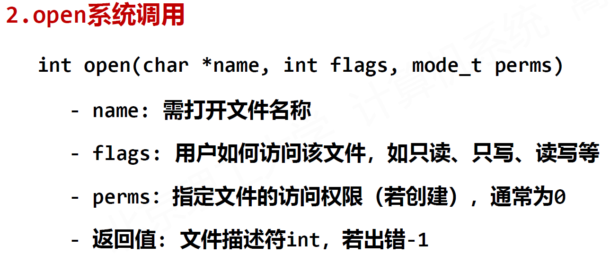


##### C标准 I/O 库函数(暂略，详见PPT P29)


#### I/O软件硬件协同

##### I/O控制方式

计算机通过各类总线、设备控制器、桥接器，在 CPU、主存
和各个 I/O 硬件设备之间建立了物理通路

底层 I/O 软件基于该通路，通过读写设备控制器中的 各类寄存
器 ，实现设备输入输出操作

I/O 操作三种形式： 程序直接控制、中断控制、 DMA 控制

##### ①程序直接控制

通过查询程序控制主机和外设的数据交换，也称为“轮询”方式
在查询程序中，安排相应的 I/O 指令
这些指令直接向设备控制器传送 控制命令
并从状态寄存器中读取外设状态 ，实现 I/O 逻辑


##### ②中断控制

I/O设备通过触发中断信号来通知计算机需要进行数据传输或其他操作
计算机会停止当前的任务，并跳转到中断处理程序
可以实现异步的数据传输，提高系统的效率和响应性

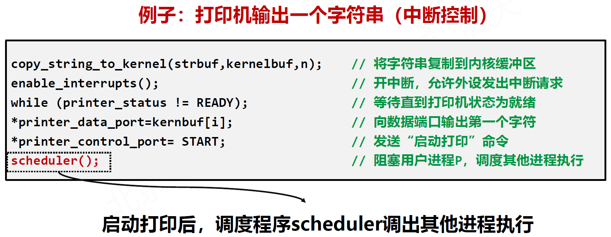


**中断控制的优势：**

启动打印后，转去执行其他进程，而将用户进程P阻塞
CPU 执行其他进程时，打印机也在工作
相较于程序控制方式提升了效率


**中断的嵌套：**

在中断处理过程中，若又有新的处理优先级更高的中断请求，
则 CPU 会暂停正在执行的中断服务程序去处理新的中断
中断响应优先级： 多个中断同时请求，哪个先被响应
中断处理优先级： 本中断与其他中断之间的处理优先关系

##### ③DMA 控制

用专门的 DMA 接口硬件控制外设和主存之间的直接数据交换，而不通过 CPU
DMA 控制下， CPU 只需要在最初“ DMA 控制器初始化”和最后处理“ DMA 结束”时介入


#### I/O内核空间操作


##### 内核空间I/O 软件

所有用户提出的 I/O 请求，最终通过系统调用实现
系统调用封装函数中设置陷阱指令
陷阱指令将程序转入内核空间的 I/O 软件中执行

##### 内核空间I/O 软件包括三个层次

**与设备无关的 I/O 软件层**： 设备驱动程序统一接口、缓冲区处
理、错误报告、文件打开与关闭等

1. 设备驱动程序统一接口： 操作系统为所有外设的驱动程序指定的统一接口，新的设备只需要按照改规范来编写就可接入
2. 所有外设抽象成文件： 设备文件名、主设备号、次设备号
3. 缓冲区处理： 用户进程在提出 I/O 请求时，用来存放数据的缓
   冲区在用户空间 fread(buf , size, num, fp)
   进入内核态，通常会在内核空间再开辟出 1~2 个缓冲区，存
   放外设的 I/O 数据

**设备驱动程序层**： 每个驱动程序针对一种外设功能而开发
与设备相关，每个设备驱动程序只处理一种外设

**中断服务程序层**： 处理每个特定的中断请求

1. 中断包括：中断响应和中断处理 ；前者由硬件完成，后者由CPU 执行一个中断服务程序完成
2. 中断服务程序通常包括：准备阶段、处理阶段和恢复阶段


# 计算机系统II

## Lecture 205 Network Layer Physical

#### 网络发展史

##### 早期

1961年前——**电话网络**
采用**电路交换技术**

1961-1972年——**包交换技术**
**分组交换技术**（Packet switching technology）也称**包交换技术**，是将用户传送的数据划分成一定的长度，每个部分叫做一个分组，通过传输分组的方式传输信息的一种技术。它是通过计算机和终端实现计算机与计算机之间的通信，在传输线路质量不高、 网络技术手段还较单一的情况下，应运而生的一种交换技术。每个分组的前面有一个分组头，用以指明该分组发往何地址，然后由交换机根据每个分组的地址标志，将他们转发至目的地，这一过程称为分组交换 。
计算机网络也采用了包交换技术。

1972-1980年——新类型网络与网络互联
Cerf和Kahan的网络互联原则：
	最小化、自治
	互联无需修改	
	尽力而为服务模型
	无状态路由
	非中心控制

1974年定义了今天的互联网架构

##### 中期

1980-1990年——互联网繁荣 

1990-2000年——互联网商业化

2000-2010年——互联网爆发 

2010-2020年——互联网沉浸入社会 

##### 定义

表示一组通过单一技术相互连接的自主计算机集合 

网络设计和运行需要考虑的因素：

1. 扩展性
2. 鲁棒性
3. 服务质量
4. 商业模式

##### 网络设备

交换机、路由器

#### 网络的分层结构

##### 网络分层模型


处理复杂的系统：
∙ 显式结构指明通信关系
∙ 模块化降低维护和升级成本

##### 网络分层的设计目的 

为了降低网络设计的复杂性，大多数网络以分层结构组织
每一层对上层承担特定服务  

##### 组网步骤

（1）交换一个比特 0或1                                                           网络层

（2）交换一组比特 0或1，形成一个网络包							物理层

（3）对于网络包，在多主体之间进行路由							 数据链路层

（4）建立某种检查机制， 确保网络包达到							传输层

（5）用户应用产生数据， 将数据分拆为多个网络包			 应用层


##### 物理层

本质
	用机械或电子方式描述一个比特0或1

实例
	用一根铜线连接两台计算机
	设置-3V到-12V为比特1，+3V到+12V为比特0 
	在铜线上加载电压，每秒钟调节2万次

##### 数据链路层

本质
	通过增加冗余位，形成校验机制，保证一个帧frame正确传输

实例
	对于7个传输的比特增加1位奇校验位
	使得8个比特位中1的个数为奇数
	传输 1110001 校验位 1

##### 网络层

本质
	给定IP地址，如何最有效的找到节点；网络能够可扩展支持更多节点

实例
	如何给互联网分配区域： 自治域
	如何在域内或域间进行网络包路由
	如何控制拥塞，保障网络可扩展性

##### 传输层

本质
	通过增加检验机制，确保网络包能够到达，形成稳定可靠传输

实例
	当网络包丢失后，能够重传
	当网络包损坏时，能够检测并要求重传

##### **OSI模型和TCP/IP模型  **


TCP/IP是事实标准，OSI是规定标准

##### 融合模型 


#### 大网络与物理层

##### 大网络

1 卫星网络 Satellite Network
2 电话网络 Public Switched Telephone Network
3 移动电话/通信网络 Mobile Telephone Network
4 有线电视网络 Cable TV Network
5 互联网 Internet

##### 卫星网络

卫星负责把地面发射的信号加强后返回给地面
	反射 = 接收 + 放大 + 发送  

##### 电话网络

电话网络诞生于1978年
	包括：本地回路、中继线、交换局  

##### 移动通信网络

​	(a) 蜂窝内相邻区域的频率通道不复用、相邻蜂窝复用频率
​	(b) 为了支持更多用户，可以缩小蜂窝尺寸  

##### 有线电视网

早期系统 
光纤+铜线 
光纤+电话线 
频谱分配 
